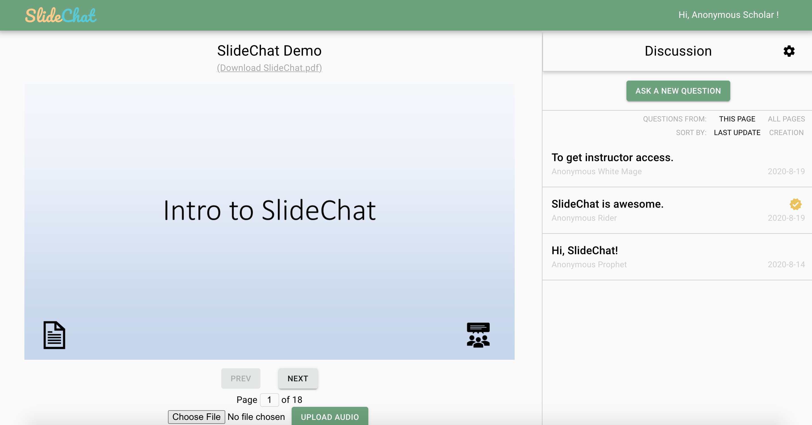
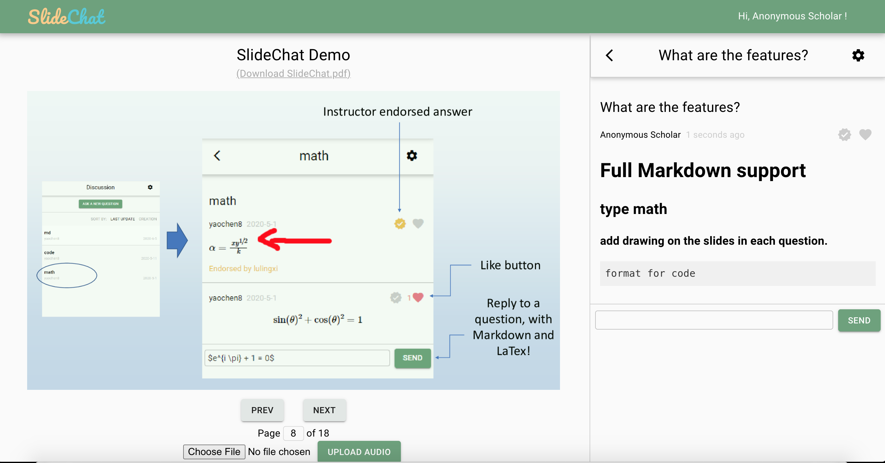
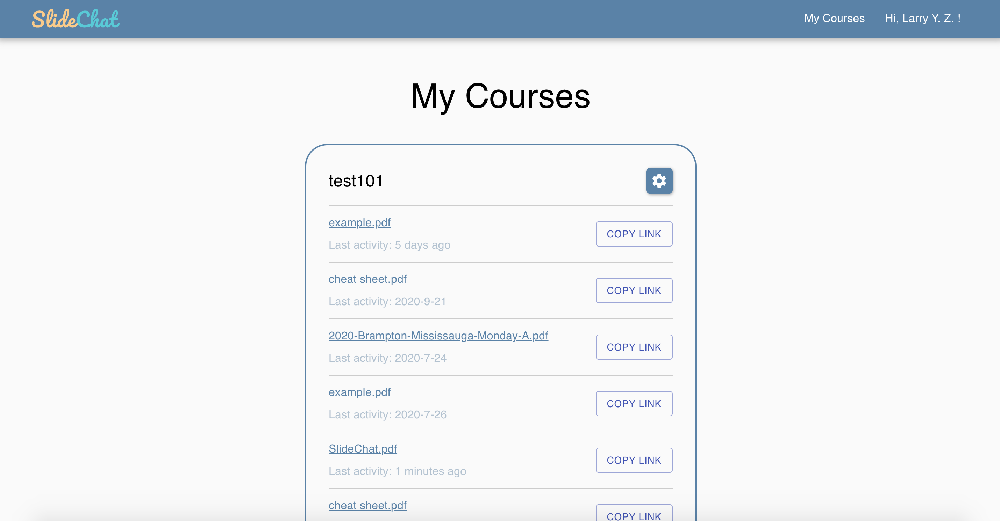

# 

An online content publishing platform that enables better communication around the slides.

## Features

-   upload a set of slides and have students discuss around each page
-   add a sound track to each page and give an asynchronous lecture
-   provides anonymous, login required anonymous or non-anonymous chat
-   use Latex math and Markdown in the chat
-   draw on the slides to highlight where you are talking about
-   provide tools to rearrange chat threads when a new version of slides is uploaded

## Screenshots

## Setup

This application requires NodeJS, MongoDB amd linux command line tool ImageMagick. Also the current version does not provide authentication, a external organization authentication(e.g. Shibboleth) is required. Please take a look at our [documentations](v2/docs/Home.md) for how to setup.

## Contact

If you have a question, find a bug, need a feature, or want to contribute, please send an issue or pull request on our GitHub page.

## Credits

SlideChat's development started at and has been supported by the University of Toronto Mississauga. Below is a list of the contributors so far.

[Ling Xiao Lu](https://github.com/lvlingxiao1), since Summer 2020

[Chen Yao](https://github.com/yaochen200811), since Summer 2020

[Kevin Hua](https://github.com/konokevinda), since Summer 2020

Aashdeep Brar, since Winter 2021

Junwen Shen, since Winter 2021

Christine Taing, since Winter 2021

Leonard Zhu, since Winter 2021

[Arujun Dhiman](https://github.com/arjundhiman786), since Fall 2016

Supervisor: [Larry Yueli Zhang](https://github.com/larryyueli), since Fall 2016
